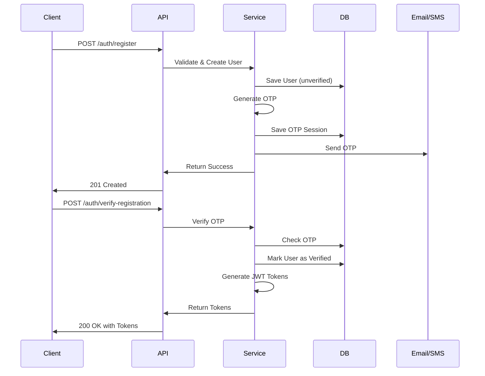
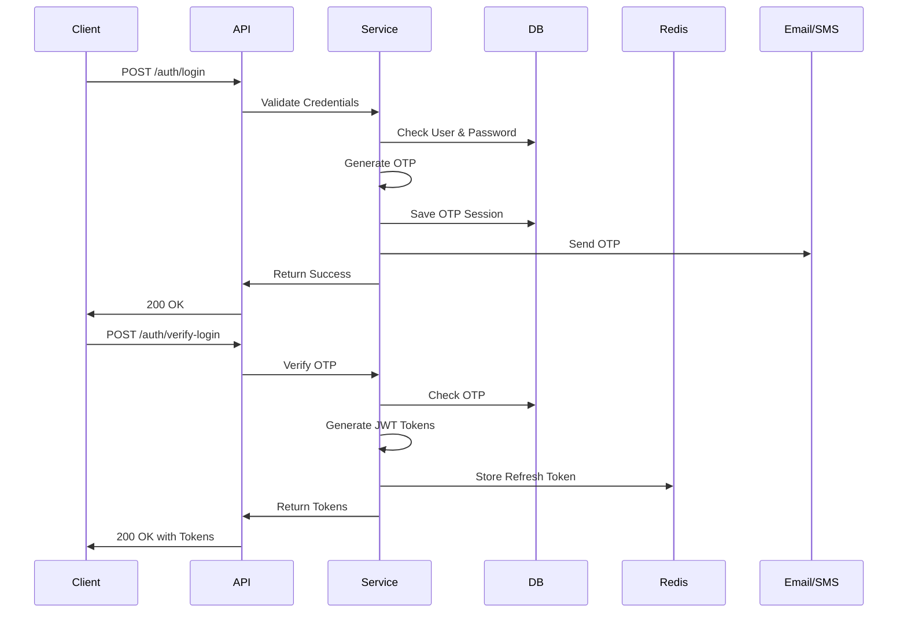

# 🍽️ Restaurant SaaS Platform

A comprehensive, enterprise-grade SaaS platform for restaurant management built with Node.js, Express, and Clean Architecture principles. This backend system provides robust authentication, multi-tenant restaurant management, and scalable infrastructure for modern restaurant operations.

[](https://nodejs.org/)
[](https://expressjs.com/)
[](LICENSE)
[](CONTRIBUTING.md)

## 📋 Table of Contents

- [Features](#-features)
- [Architecture](#-architecture)
- [Tech Stack](#-tech-stack)
- [Project Structure](#-project-structure)
- [Getting Started](#-getting-started)
- [Environment Variables](#-environment-variables)
- [API Documentation](#-api-documentation)
- [Database Schema](#-database-schema)
- [Authentication Flow](#-authentication-flow)
- [Development](#-development)
- [Testing](#-testing)
- [Deployment](#-deployment)
- [Contributing](#-contributing)
- [License](#-license)

## ✨ Features

### 🔐 Authentication & Security
- **JWT-based authentication** with access and refresh tokens
- **OTP verification** for registration, login, and password reset
- **Multi-channel OTP delivery** (Email & SMS)
- **Session management** with Redis-based token storage
- **Password encryption** using bcrypt
- **Role-based access control** (RBAC)
- **Request validation** and sanitization

### 👥 User Management
- User registration with email/phone verification
- Secure login with OTP verification
- Password reset workflow
- Profile management
- Change password functionality
- User session tracking

### 🏪 Restaurant Management
- Multi-tenant restaurant support
- Restaurant CRUD operations
- Branch management system
- Restaurant-branch hierarchical structure
- Owner/manager role assignment
- Restaurant metadata and settings

### 🏢 Branch Operations
- Branch CRUD operations
- Location-based branch management
- Branch-specific configurations
- Staff assignment per branch
- Operating hours management

### 🛠️ Infrastructure
- **Redis caching** for improved performance
- **Database migrations** with Sequelize
- **Repository pattern** for data access
- **Centralized error handling**
- **Request/Response helpers**
- **Email service integration**
- **SMS service integration**
- **Environment validation**

## 🏗️ Architecture

This project follows **Clean Architecture** principles with clear separation of concerns:

```
┌─────────────────────────────────────────────────┐
│                   API Layer                     │
│            (Routes, Controllers)                │
└────────────────┬────────────────────────────────┘
                 │
┌────────────────▼────────────────────────────────┐
│              Application Layer                  │
│         (Use Cases, Services)                   │
└────────────────┬────────────────────────────────┘
                 │
┌────────────────▼────────────────────────────────┐
│               Domain Layer                      │
│        (Entities, Interfaces)                   │
└────────────────┬────────────────────────────────┘
                 │
┌────────────────▼────────────────────────────────┘
│           Infrastructure Layer                  │
│    (Database, Cache, External Services)         │
└─────────────────────────────────────────────────┘
```

### Layer Responsibilities

**API Layer** (`src/api/`)
- HTTP request handling
- Route definitions
- Request validation
- Response formatting
- Middleware orchestration

**Application Layer** (`src/application/`)
- Business logic implementation
- Use case orchestration
- Service coordination
- Data transformation

**Domain Layer** (`src/domain/`)
- Core business entities
- Repository interfaces
- Business rules
- Domain models

**Infrastructure Layer** (`src/infrastructure/`)
- Database implementations
- External service integrations
- Caching mechanisms
- Third-party API clients

## 🚀 Tech Stack

### Core
- **Runtime:** Node.js 18.x
- **Framework:** Express.js 4.x
- **Language:** JavaScript (ES6+)

### Database & ORM
- **Database:** PostgreSQL / MySQL
- **ORM:** Sequelize
- **Migrations:** Sequelize CLI

### Authentication & Security
- **JWT:** jsonwebtoken
- **Encryption:** bcrypt
- **Validation:** Joi / express-validator

### Caching & Session
- **Cache:** Redis
- **Session Store:** Redis

### Communication
- **Email:** Nodemailer
- **SMS:** Twilio / Custom SMS Provider

### Development Tools
- **Process Manager:** PM2
- **Environment:** dotenv
- **Logging:** Winston / Morgan
- **Code Quality:** ESLint, Prettier

## 📁 Project Structure

```
restaurant-saas/
├── src/
│   ├── api/                      # API Layer
│   │   ├── controllers/          # Request handlers
│   │   │   ├── auth.controller.js
│   │   │   ├── user.controller.js
│   │   │   ├── restaurant.controller.js
│   │   │   └── branch.controller.js
│   │   ├── middlewares/          # Express middlewares
│   │   │   ├── auth.middleware.js
│   │   │   ├── authorization.middleware.js
│   │   │   ├── errorHandler.middleware.js
│   │   │   └── validation.middleware.js
│   │   ├── routes/               # API routes
│   │   │   ├── auth.routes.js
│   │   │   ├── user.routes.js
│   │   │   ├── restaurant.routes.js
│   │   │   └── branch.routes.js
│   │   └── validators/           # Request validators
│   │       ├── auth.validator.js
│   │       ├── user.validator.js
│   │       ├── restaurant.validator.js
│   │       └── branch.validator.js
│   │
│   ├── application/              # Application Layer
│   │   ├── services/             # Business logic services
│   │   │   ├── auth.service.js
│   │   │   ├── user.service.js
│   │   │   ├── restaurant.service.js
│   │   │   ├── branch.service.js
│   │   │   └── otp.service.js
│   │   └── use-cases/            # Use case implementations
│   │       ├── auth/
│   │       ├── user/
│   │       ├── restaurant/
│   │       └── branch/
│   │
│   ├── domain/                   # Domain Layer
│   │   ├── entities/             # Domain entities
│   │   │   ├── User.js
│   │   │   ├── Restaurant.js
│   │   │   └── Branch.js
│   │   ├── interfaces/           # Repository interfaces
│   │   │   ├── IUserRepository.js
│   │   │   ├── IRestaurantRepository.js
│   │   │   └── IBranchRepository.js
│   │   └── models/               # Domain models
│   │
│   ├── infrastructure/           # Infrastructure Layer
│   │   ├── database/             # Database configuration
│   │   │   ├── config/
│   │   │   │   └── database.js
│   │   │   ├── migrations/       # Database migrations
│   │   │   ├── models/           # Sequelize models
│   │   │   │   ├── User.model.js
│   │   │   │   ├── Restaurant.model.js
│   │   │   │   ├── Branch.model.js
│   │   │   │   └── index.js
│   │   │   └── seeders/          # Database seeders
│   │   │
│   │   ├── repositories/         # Repository implementations
│   │   │   ├── user.repository.js
│   │   │   ├── restaurant.repository.js
│   │   │   └── branch.repository.js
│   │   │
│   │   ├── cache/                # Caching layer
│   │   │   ├── redis.client.js
│   │   │   └── cache.service.js
│   │   │
│   │   └── external-services/    # External integrations
│   │       ├── email/
│   │       │   └── mailer.service.js
│   │       └── sms/
│   │           └── sms.service.js
│   │
│   ├── config/                   # Application configuration
│   │   ├── app.config.js
│   │   ├── auth.config.js
│   │   ├── redis.config.js
│   │   └── env.validation.js
│   │
│   └── utils/                    # Utility functions
│       ├── helpers/              # Helper functions
│       │   ├── response.helper.js
│       │   ├── error.helper.js
│       │   └── jwt.helper.js
│       ├── constants/            # Application constants
│       │   ├── errorCodes.js
│       │   ├── roles.js
│       │   └── statusCodes.js
│       └── logger/               # Logging utilities
│           └── logger.js
│
├── tests/                        # Test files
│   ├── unit/
│   ├── integration/
│   └── e2e/
│
├── .env.example                  # Environment variables template
├── .gitignore
├── .eslintrc.js
├── .prettierrc
├── package.json
├── README.md
└── server.js                     # Application entry point
```

## 🚦 Getting Started

### Prerequisites

- Node.js >= 18.x
- PostgreSQL >= 13.x or MySQL >= 8.x
- Redis >= 6.x
- npm or yarn

### Installation

1. **Clone the repository**
```bash
git clone https://github.com/mohamedhamdhy/saas-restauran.git
cd saas-restaurant
```

2. **Install dependencies**
```bash
npm install
```

3. **Configure environment variables**
```bash
cp .env.example .env
# Edit .env with your configuration
```

4. **Setup database**
```bash
# Create database
createdb restaurant_saas

# Run migrations
npm run migrate

# (Optional) Seed database
npm run seed
```

5. **Start Redis server**
```bash
redis-server
```

6. **Run the application**
```bash
# Development mode
npm run dev

# Production mode
npm start
```

The server will start on `http://localhost:3000` (or your configured port).

## 🔧 Environment Variables

Create a `.env` file in the root directory with the following variables:

```env
# Application
NODE_ENV=development
PORT=3000
API_VERSION=v1

# Database
DB_HOST=localhost
DB_PORT=5432
DB_NAME=restaurant_saas
DB_USER=postgres
DB_PASSWORD=your_password
DB_DIALECT=postgres

# Redis
REDIS_HOST=localhost
REDIS_PORT=6379
REDIS_PASSWORD=
REDIS_DB=0

# JWT
JWT_SECRET=your_super_secret_jwt_key_change_this
JWT_REFRESH_SECRET=your_super_secret_refresh_key_change_this
JWT_ACCESS_EXPIRATION=15m
JWT_REFRESH_EXPIRATION=7d

# OTP
OTP_EXPIRATION=300
OTP_LENGTH=6

# Email (Nodemailer)
SMTP_HOST=smtp.gmail.com
SMTP_PORT=587
SMTP_SECURE=false
SMTP_USER=your_email@gmail.com
SMTP_PASSWORD=your_app_password
EMAIL_FROM=noreply@restaurant-saas.com

# SMS (Twilio)
SMS_PROVIDER=twilio
TWILIO_ACCOUNT_SID=your_account_sid
TWILIO_AUTH_TOKEN=your_auth_token
TWILIO_PHONE_NUMBER=+1234567890

# Security
BCRYPT_ROUNDS=10
RATE_LIMIT_WINDOW=15
RATE_LIMIT_MAX_REQUESTS=100

# Logging
LOG_LEVEL=info
LOG_FILE_PATH=./logs
```

## 📚 API Documentation

### Base URL
```
http://localhost:3000/api/v1
```

### Authentication Endpoints

#### Register User
```http
POST /auth/register
Content-Type: application/json

{
  "email": "user@example.com",
  "phone": "+1234567890",
  "password": "SecurePassword123!",
  "firstName": "John",
  "lastName": "Doe"
}

Response: 201 Created
{
  "success": true,
  "message": "Registration successful. OTP sent for verification.",
  "data": {
    "userId": "uuid",
    "email": "user@example.com",
    "otpSent": true
  }
}
```

#### Verify Registration OTP
```http
POST /auth/verify-registration
Content-Type: application/json

{
  "email": "user@example.com",
  "otp": "123456"
}

Response: 200 OK
{
  "success": true,
  "message": "Account verified successfully",
  "data": {
    "accessToken": "jwt_access_token",
    "refreshToken": "jwt_refresh_token",
    "user": {
      "id": "uuid",
      "email": "user@example.com",
      "firstName": "John",
      "lastName": "Doe"
    }
  }
}
```

#### Login
```http
POST /auth/login
Content-Type: application/json

{
  "email": "user@example.com",
  "password": "SecurePassword123!"
}

Response: 200 OK
{
  "success": true,
  "message": "OTP sent to your email",
  "data": {
    "otpSent": true,
    "expiresIn": 300
  }
}
```

#### Verify Login OTP
```http
POST /auth/verify-login
Content-Type: application/json

{
  "email": "user@example.com",
  "otp": "123456"
}

Response: 200 OK
{
  "success": true,
  "message": "Login successful",
  "data": {
    "accessToken": "jwt_access_token",
    "refreshToken": "jwt_refresh_token",
    "user": { ... }
  }
}
```

#### Refresh Token
```http
POST /auth/refresh
Content-Type: application/json

{
  "refreshToken": "jwt_refresh_token"
}

Response: 200 OK
{
  "success": true,
  "data": {
    "accessToken": "new_jwt_access_token"
  }
}
```

#### Forgot Password
```http
POST /auth/forgot-password
Content-Type: application/json

{
  "email": "user@example.com"
}

Response: 200 OK
{
  "success": true,
  "message": "Password reset OTP sent to your email"
}
```

#### Reset Password
```http
POST /auth/reset-password
Content-Type: application/json

{
  "email": "user@example.com",
  "otp": "123456",
  "newPassword": "NewSecurePassword123!"
}

Response: 200 OK
{
  "success": true,
  "message": "Password reset successfully"
}
```

#### Logout
```http
POST /auth/logout
Authorization: Bearer {access_token}

Response: 200 OK
{
  "success": true,
  "message": "Logout successful"
}
```

### User Endpoints

#### Get Profile
```http
GET /users/profile
Authorization: Bearer {access_token}

Response: 200 OK
{
  "success": true,
  "data": {
    "id": "uuid",
    "email": "user@example.com",
    "firstName": "John",
    "lastName": "Doe",
    "phone": "+1234567890",
    "isVerified": true,
    "createdAt": "2024-01-01T00:00:00.000Z"
  }
}
```

#### Update Profile
```http
PUT /users/profile
Authorization: Bearer {access_token}
Content-Type: application/json

{
  "firstName": "Jane",
  "lastName": "Smith",
  "phone": "+1987654321"
}

Response: 200 OK
{
  "success": true,
  "message": "Profile updated successfully",
  "data": { ... }
}
```

#### Change Password
```http
POST /users/change-password
Authorization: Bearer {access_token}
Content-Type: application/json

{
  "currentPassword": "OldPassword123!",
  "newPassword": "NewPassword123!"
}

Response: 200 OK
{
  "success": true,
  "message": "Password changed successfully"
}
```

### Restaurant Endpoints

#### Create Restaurant
```http
POST /restaurants
Authorization: Bearer {access_token}
Content-Type: application/json

{
  "name": "Delicious Bites",
  "description": "A modern dining experience",
  "cuisine": "Italian",
  "phone": "+1234567890",
  "email": "info@deliciousbites.com",
  "address": {
    "street": "123 Main St",
    "city": "New York",
    "state": "NY",
    "zipCode": "10001",
    "country": "USA"
  }
}

Response: 201 Created
{
  "success": true,
  "message": "Restaurant created successfully",
  "data": {
    "id": "uuid",
    "name": "Delicious Bites",
    ...
  }
}
```

#### Get All Restaurants
```http
GET /restaurants
Authorization: Bearer {access_token}

Response: 200 OK
{
  "success": true,
  "data": [
    {
      "id": "uuid",
      "name": "Delicious Bites",
      "cuisine": "Italian",
      ...
    }
  ],
  "pagination": {
    "page": 1,
    "limit": 10,
    "total": 25
  }
}
```

#### Get Restaurant by ID
```http
GET /restaurants/:id
Authorization: Bearer {access_token}

Response: 200 OK
{
  "success": true,
  "data": {
    "id": "uuid",
    "name": "Delicious Bites",
    "branches": [ ... ]
  }
}
```

#### Update Restaurant
```http
PUT /restaurants/:id
Authorization: Bearer {access_token}
Content-Type: application/json

{
  "name": "Updated Restaurant Name",
  "description": "Updated description"
}

Response: 200 OK
{
  "success": true,
  "message": "Restaurant updated successfully",
  "data": { ... }
}
```

#### Delete Restaurant
```http
DELETE /restaurants/:id
Authorization: Bearer {access_token}

Response: 200 OK
{
  "success": true,
  "message": "Restaurant deleted successfully"
}
```

### Branch Endpoints

#### Create Branch
```http
POST /restaurants/:restaurantId/branches
Authorization: Bearer {access_token}
Content-Type: application/json

{
  "name": "Downtown Branch",
  "phone": "+1234567890",
  "email": "downtown@deliciousbites.com",
  "address": {
    "street": "456 Park Ave",
    "city": "New York",
    "state": "NY",
    "zipCode": "10022",
    "country": "USA"
  },
  "operatingHours": {
    "monday": { "open": "09:00", "close": "22:00" },
    "tuesday": { "open": "09:00", "close": "22:00" }
  }
}

Response: 201 Created
{
  "success": true,
  "message": "Branch created successfully",
  "data": { ... }
}
```

#### Get All Branches
```http
GET /restaurants/:restaurantId/branches
Authorization: Bearer {access_token}

Response: 200 OK
{
  "success": true,
  "data": [ ... ]
}
```

#### Update Branch
```http
PUT /branches/:id
Authorization: Bearer {access_token}
Content-Type: application/json

{
  "name": "Updated Branch Name"
}

Response: 200 OK
{
  "success": true,
  "message": "Branch updated successfully",
  "data": { ... }
}
```

#### Delete Branch
```http
DELETE /branches/:id
Authorization: Bearer {access_token}

Response: 200 OK
{
  "success": true,
  "message": "Branch deleted successfully"
}
```

## 💾 Database Schema

### Users Table
```sql
CREATE TABLE users (
  id UUID PRIMARY KEY DEFAULT uuid_generate_v4(),
  email VARCHAR(255) UNIQUE NOT NULL,
  phone VARCHAR(20) UNIQUE,
  password_hash VARCHAR(255) NOT NULL,
  first_name VARCHAR(100) NOT NULL,
  last_name VARCHAR(100) NOT NULL,
  is_verified BOOLEAN DEFAULT FALSE,
  is_active BOOLEAN DEFAULT TRUE,
  role VARCHAR(50) DEFAULT 'user',
  created_at TIMESTAMP DEFAULT CURRENT_TIMESTAMP,
  updated_at TIMESTAMP DEFAULT CURRENT_TIMESTAMP
);
```

### Restaurants Table
```sql
CREATE TABLE restaurants (
  id UUID PRIMARY KEY DEFAULT uuid_generate_v4(),
  owner_id UUID REFERENCES users(id) ON DELETE CASCADE,
  name VARCHAR(255) NOT NULL,
  description TEXT,
  cuisine VARCHAR(100),
  phone VARCHAR(20),
  email VARCHAR(255),
  address JSONB,
  is_active BOOLEAN DEFAULT TRUE,
  created_at TIMESTAMP DEFAULT CURRENT_TIMESTAMP,
  updated_at TIMESTAMP DEFAULT CURRENT_TIMESTAMP
);
```

### Branches Table
```sql
CREATE TABLE branches (
  id UUID PRIMARY KEY DEFAULT uuid_generate_v4(),
  restaurant_id UUID REFERENCES restaurants(id) ON DELETE CASCADE,
  name VARCHAR(255) NOT NULL,
  phone VARCHAR(20),
  email VARCHAR(255),
  address JSONB,
  operating_hours JSONB,
  is_active BOOLEAN DEFAULT TRUE,
  created_at TIMESTAMP DEFAULT CURRENT_TIMESTAMP,
  updated_at TIMESTAMP DEFAULT CURRENT_TIMESTAMP
);
```

### OTP Sessions Table
```sql
CREATE TABLE otp_sessions (
  id UUID PRIMARY KEY DEFAULT uuid_generate_v4(),
  user_id UUID REFERENCES users(id) ON DELETE CASCADE,
  otp_hash VARCHAR(255) NOT NULL,
  purpose VARCHAR(50) NOT NULL,
  expires_at TIMESTAMP NOT NULL,
  is_used BOOLEAN DEFAULT FALSE,
  created_at TIMESTAMP DEFAULT CURRENT_TIMESTAMP
);
```

## 🔒 Authentication Flow

### Registration Flow


### Login Flow


## 🧪 Testing

### Run Tests
```bash
# Run all tests
npm test

# Run unit tests
npm run test:unit

# Run integration tests
npm run test:integration

# Run e2e tests
npm run test:e2e

# Generate coverage report
npm run test:coverage
```

### Test Structure
```
tests/
├── unit/
│   ├── services/
│   ├── repositories/
│   └── utils/
├── integration/
│   ├── api/
│   └── database/
└── e2e/
    └── flows/
```

## 🔨 Development

### Available Scripts

```bash
# Development with hot reload
npm run dev

# Start production server
npm start

# Run database migrations
npm run migrate

# Rollback last migration
npm run migrate:undo

# Create new migration
npm run migration:create -- --name migration-name

# Seed database
npm run seed

# Lint code
npm run lint

# Format code
npm run format

# Type check
npm run type-check
```

### Code Style

This project uses ESLint and Prettier for code quality and formatting:

```bash
# Check linting issues
npm run lint

# Fix linting issues
npm run lint:fix

# Format code
npm run format
```

### Git Hooks

Pre-commit hooks are configured to:
- Run linting
- Format code
- Run tests
- Validate commit messages

## 🚢 Deployment

### Using PM2

```bash
# Install PM2 globally
npm install -g pm2

# Start application
pm2 start ecosystem.config.js

# Monitor
pm2 monit

# View logs
pm2 logs

# Restart
pm2 restart restaurant-saas

# Stop
pm2 stop restaurant-saas
```

### Docker Deployment

```dockerfile
# Dockerfile
FROM node:18-alpine

WORKDIR /app

COPY package*.json ./
RUN npm ci --only=production

COPY . .

EXPOSE 3000

CMD ["npm", "start"]
```

```bash
# Build image
docker build -t restaurant-saas .

# Run container
docker run -p 3000:3000 --env-file .env restaurant-saas
```

### Docker Compose

```yaml
version: '3.8'

services:
  app:
    build: .
    ports:
      - "3000:3000"
    environment:
      - NODE_ENV=production
    depends_on:
      - db
      - redis
    
  db:
    image: postgres:15
    environment:
      POSTGRES_DB: restaurant_saas
      POSTGRES_USER: postgres
      POSTGRES_PASSWORD: password
    volumes:
      - postgres_data:/var/lib/postgresql/data
  
  redis:
    image: redis:7-alpine
    ports:
      - "6379:6379"

volumes:
  postgres_data:
```

### Environment-Specific Configurations

**Production Checklist:**
- [ ] Set `NODE_ENV=production`
- [ ] Use strong JWT secrets
- [ ] Enable HTTPS
- [ ] Configure rate limiting
- [ ] Setup monitoring and logging
- [ ] Enable database backups
- [ ] Configure CORS properly
- [ ] Setup SSL/TLS for Redis
- [ ] Use connection pooling
- [ ] Enable compression
- [ ] Setup health checks
- [ ] Configure reverse proxy (Nginx)

## 📊 Performance Optimization

### Implemented Optimizations
- **Redis caching** for frequently accessed data
- **Database indexing** on frequently queried fields
- **Connection pooling** for database connections
- **JWT token caching** in Redis
- **Pagination** for large data sets
- **Lazy loading** for relationships
- **Query optimization** with Sequelize

### Monitoring
```bash
# Monitor application
pm2 monit

# View logs
pm2 logs restaurant-saas

# Check memory usage
pm2 show restaurant-saas
```

## 🔍 Troubleshooting

### Common Issues

**Database Connection Failed**
```bash
# Check database is running
pg_isready

# Verify credentials in .env
# Check firewall settings
```

**Redis Connection Failed**
```bash
# Check Redis is running
redis-cli ping

# Should return PONG
```

**OTP Not Received**
```bash
# Check email configuration
# Verify SMTP credentials
# Check spam folder
# Review application logs
```

**JWT Token Invalid**
```bash
# Verify JWT_SECRET in .env
# Check token expiration
# Ensure clock synchronization
```

## 🤝 Contributing

We welcome contributions! Please follow these guidelines:

1. **Fork the repository**
2. **Create a feature branch**
   ```bash
   git checkout -b feature/amazing-feature
   ```
3. **Commit your changes**
   ```bash
   git commit -m 'feat: add amazing feature'
   ```
4. **Push to the branch**
   ```bash
   git push origin feature/amazing-feature
   ```
5. **Open a Pull Request**

### Commit Convention
We follow [Conventional Commits](https://www.conventionalcommits.org/):

- `feat:` New feature
- `fix:` Bug fix
- `docs:` Documentation changes
- `style:` Code style changes (formatting, etc.)
- `refactor:` Code refactoring
- `test:` Adding or updating tests
- `chore:` Maintenance tasks

## 📄 License

This project is licensed under the MIT License - see the [LICENSE](LICENSE) file for details.

## 👥 Authors

- **Mohamed Al Hamdhy** - *Initial work* - [YourGithub](https://github.com/mohamedhamdhy)

## 🙏 Acknowledgments

- Express.js community
- Sequelize ORM
- Redis Labs
- All contributors

## 📞 Support

For support, email support - mohamedalhamdhy@gmail.com.

## 🗺️ Roadmap

- [ ] Multi-language support (i18n)
- [ ] Advanced analytics dashboard
- [ ] Menu management system
- [ ] Order management
- [ ] Table reservation system
- [ ] Inventory tracking
- [ ] Employee management
- [ ] Payment integration
- [ ] Customer loyalty program
- [ ] Mobile app integration
- [ ] Real-time notifications
- [ ] Advanced reporting

---

**Made with ❤️ by Mohamed Al Hamdhy**
